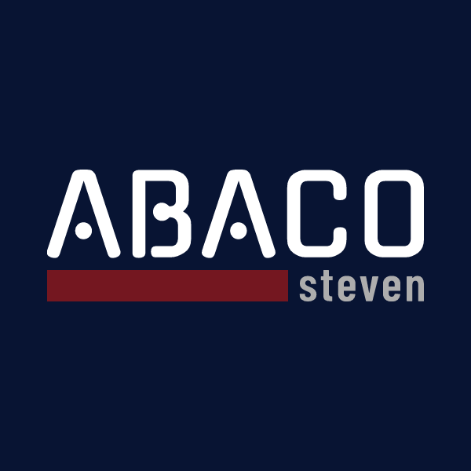

# 
###  Hi &nbsp;  

I'm an aspiring Full-Stack Web Developer.  

This is where I collaborate with fellow developers.

It's also where I share my projects I'm working on or completed

### LET'S CONNECT &nbsp; 

&nbsp;&nbsp;&nbsp;&nbsp; 
&nbsp;&nbsp;&nbsp;&nbsp;&nbsp;
&nbsp;&nbsp;&nbsp;&nbsp;&nbsp;

###  DEV TOOLBELT & SKILLS 

&nbsp;&nbsp;&nbsp;&nbsp;
&nbsp;&nbsp;&nbsp;&nbsp;
&nbsp;&nbsp;&nbsp;&nbsp;
&nbsp;&nbsp;&nbsp;&nbsp;
&nbsp;&nbsp;&nbsp;&nbsp;
&nbsp;&nbsp;&nbsp;&nbsp;
&nbsp;&nbsp;&nbsp;&nbsp;

### MORE ABOUT ME 
- 🔭 - I’m an aspiring Full Stack Web Developer. Formerly a Construction Project Manager ❗
- 🌱 - I’m currently focused on mastering the MERN stack (MongoDb, Express, ReactJs, NodeJs) ❗

